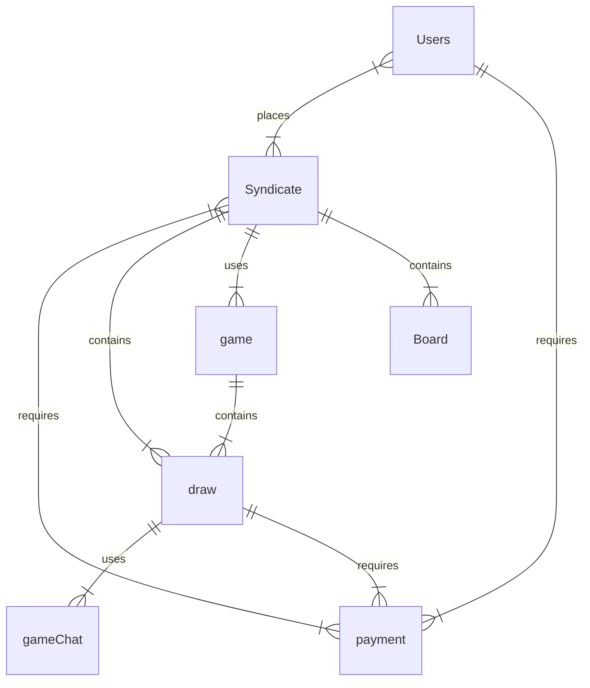
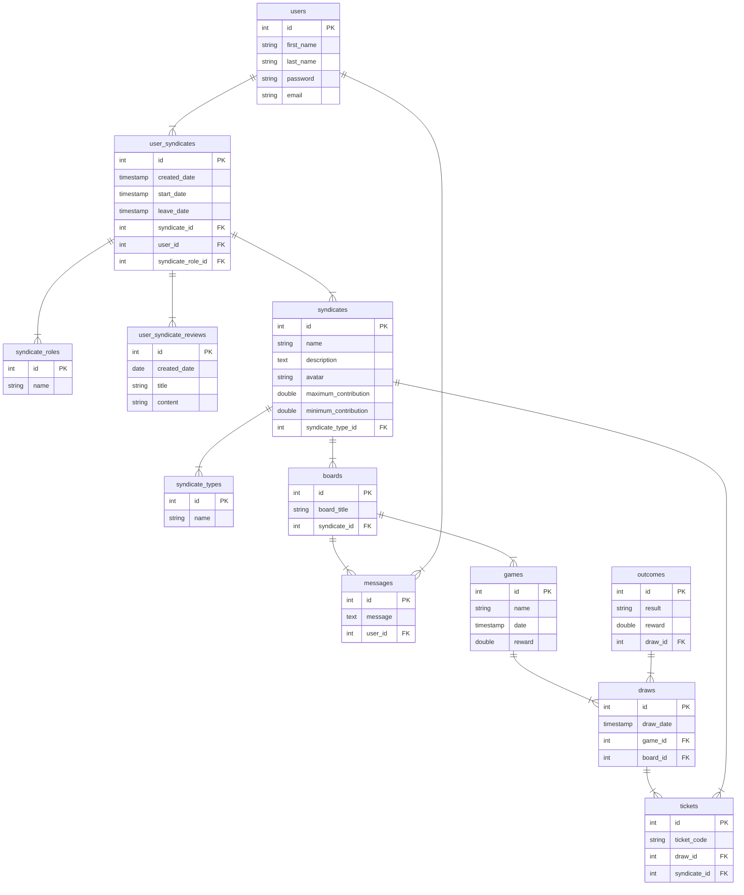

# syndicate lotto manager application
## Overview

This application serves as a manager for various lottery syndicates. It allows users to create syndicates and establish their own rules such as defining minimum and maximum contributions, setting the syndicate as public or private, outlining how funds are distributed percentage-wise, and determining the contribution cutoff date. Users also have the option to enable or disable voting within the syndicate, voting will be used for important descisions, for example keeping the winnings in a pool to buy more lotto tickets, or splitting the winnings.

Once a user creates a syndicate, it becomes accessible for other users to join or request membership. The syndicate owner, who also acts as the moderator, retains the right to invite other users. They can also play various roles, including promoting syndicate members to higher levels of authority, further enhancing the interactive dynamics of the group, and if necessary, removing members.

users of this application have the ability to join or request to join multiple syndicates, subject to the group rules. They can opt in or out of contributing to draws and decide on the amount they wish to invest in a particular draw. Rewards are then distributed according to their respective contributions.

Key features of the application include:

Communication: Users can communicate within their respective syndicates, fostering a sense of community and collaboration.
Live Lotto Results: Users can access a live stream of lotto results in a separate chat. If voting is enabled by the moderator, contributors can decide whether to reinvest the winnings into more tickets or to distribute the winnings among themselves.
Reviews: Users can leave reviews on the syndicates they have been part of for a minimum of one week (to prevent hit-and-run reviewing) and after contributing to at least one draw.
Automatic Payments: Users can set up an automatic payments system to facilitate contributions whenever a specific draw happens in a particular group.
Identification: For legal compliance, users will be required to provide valid identification.
Profile Customization: An integrated camera feature allows users to personalize their profile with pictures and syndicate groups to set unique cover photos.
cash bonuses: To stimulate people to buy more tickets, cash rewards will be given to groups with the highest win rates

## problem definition
Lottery pools often face numerous challenges, as outlined by sources like the Health Lottery. With substantial sums of money involved, there's always a heightened risk of unscrupulous individuals attempting to defraud other participants. This risk has precipitated several lawsuits, revolving around disputes such as participant inclusion, correct number selection, ticket purchase authenticity, group or private ticket procurement, among others. There have been instances of deceitful pool managers who collected funds for lottery pools, but absconded with the cash without buying the intended tickets. Measures to prevent such conduct are currently insufficient.

Setting up a lottery syndicate typically requires a manager responsible for controlling group activities. Traditional duties of a manager include collecting money, purchasing tickets, managing the prize money, and distributing winnings. This responsibility necessitates extensive record keeping and can lead to errors, particularly in larger groups.

Another prevalent issue with lottery pools is the division of prize money among participants, which often results in smaller winnings per individual. Some lottery pools introduce a shares system, where your contribution directly impacts your potential winnings: the more you contribute, the higher your share of the prize.

Trust is another key issue in lottery pools. To ensure safety, every participant who contributes should receive a copy of the purchased tickets, mitigating the risk of false claims. However, it's inconvenient and time-consuming to conduct due diligence on moderators or members within a pool, which involves conducting background checks and scouring the internet for information about them. A centralized hub providing information on individual's past dealings would be immensely beneficial for transparency.

Timely payment from individual participants is another significant issue plaguing many lottery pools.

Additional problems become evident when reviewing large syndicates like the Lotter. Participants often express concerns about ticket security. Once you pay, the syndicate owns the ticket, leaving room for potential denials of your rightful claim.

## Requirements
I will use the MoSCoW prioritization technique for managing the requirements, M - must have, S- Should have, C- Could have, W- Will not have.

### Must have

.A user must be able to log on


.A user must be able to customise their own profile  

.A user must be able to use the camera to take photos

.A user must be able to create their own syndicate

.A moderator must be able to make their syndicate private or public

.A moderator  must be able to customise their syndicate

.A moderator must be able to  invite members to their syndicate .

.A user must be able to search for syndicates to join

.A user must be able to request to join private syndicates

.A user must be able to join public syndicates

.A user must be able to communicate with other syndicate members

.A member must be able to contribute towards a draw

.A user must be able to join multiple syndicates

.A member must contribute a limit set by the moderator

.A member must be able to opt in or out of draws

.A member must be able to leave a group

.A user must be able to leave reviews 

.A user must be able to access this application on the web or their phone

.A user must be able to view any syndicate's reviews 

### Should have
.A moderator should be able to customise their syndicate’s rules

.A user must be able to receive the percentage of what they contributed to the tickets from the rewards

.A user should be able to vote whether to carry on holding the winnings to buy more tickets, or receive winnings

.A moderator should be able to promote users to different positions within their syndicate

.A user should have access, and be able to search for live lotto results

.A member must only be able to review a group, after a week, and contributing to a draw

### Could have
.A syndicate will record their win loss history, and total profits

.A user will be able to view their win/loss history and total profits

.A member could be able to enter another chat, with anyone who bought tickets

.A member could be able to live stream the lottery results within that chat

.A user could have to produce identification in order to verify their login details

.A member could receive a copy of the lotto tickets bought

.A user could download the application on their phone

.A user could be able to set up automatic payments to particular draws

### Will not have
.The system won’t have it’s own payment method, it will need to use stripe

.The system won’t give out rewards for the groups with highest win rates
##  domain model diagram


## entity relationship diagram

## API design
#### getting users
GET /users
Response 200
returns all users
```json
[
  {
    "id": 1,
    "first_name": "Lorna",
    "last_name": "McKinley",
    "password": "password123"
    "email": "john@example.com",
  },
  {
    "id": 2,
    first_name": "Jane",
    "last_name": "smith",
    "password": "secret321"
    "email": "jane@example.com",
    
  }
]
```
GET /users/{user_id}/
response 200 OK
response 404 Not found
returns a list of users of a specific user ID
```json
  {
    "id": 1,
    "first_name": "Lorna",
    "last_name": "McKinley",
    "password": "password123"
    "email": "john@example.com",
  },
```
  POST /users/
  creates users data
  Request 
  ```json
  {
 "first_name": "Thomas",
    "last_name": "McKee",
    "password": "password123"
    "email": "Thomas@example.com",
  }
  ```
  201 Created
400 Bad Request
```json
{
    "id": 1,
 "first_name": "Thomas",
    "last_name": "McKee",
    "password": "password123"
    "email": "Thomas@example.com",
  }
  ```
PUT /users/{userId}/

Updates user's details

NOTE: Password is an optional field, if it is not supplied, it is not updated.
```json
Request:
{
  "id": 1,
 "first_name": "Thomas",
    "last_name": "McKee",
    "password": "password123",
    "email": "Thomas@example.com",
}
```

Responses:

204 No Content
400 Bad Request
404 Not Found

  DELETE /users/{userId}/
```json
{
    "userId": "1",
    "message": "account deleted",
    
}
```
Response: 204 No Content
## syndicates


GET /users_syndicates/users/{userId}/
response 200
```json
{
    "id": 1,
    "created_date": "02:10:2022",
    "end_date": "03:11:2022",
    "user_id": "1",
    "syndicate_id": "1",
    "syndicate_role_id": "1",

}
{
    "id": 1,
    "created_date": 01/10/2022
}
```

#### setting up synicate

GET /syndicate-type
```json
{
    "id": "1",
    "name": "private"
}
[
    "id": "2",
    "name": "public",
]
```
POST /syndicates/{syndicate-typeId}
```json
{
    "name": "bestSyndicate",
    "description": "A great syndicate",
    "avatar": "cover photo",
    "maximum_contribution": "2",
    "syndicate_type_id": "1",

}
```
GET /syndicates
```json
[
    {
    "syndicate_id": "1",
    "name": "bestSyndicate",
    "description": "A great syndicate",
    "avatar": "cover photo",
    "maximum_contribution": "2",
    "syndicate_type_id": "1",

}
]
```

GET /sydicate-roles
```json
[
{
    "id": "1",
    "name": "member",
},[
    "id": "2",
    "name": "master",
]

]
```
POST users/{user_id}/user-syndicates/{syndicateId}/{userId}/{syndicate-roleId}
```json
//adding to the syndicate user table
[
    {
    "created_date": "3/08/2022",
    "start_date": "2/09/2023",
    "leave_date": "1/10/2023",
    "syndicate_id": "1",
    "user_id": "2"
    "syndicate_role": "2",
    }
]
```
response 201 Created
GET /users/{userId}/user-syndicates
```json
{
    "id" : "1"
     "created_date": "3/08/2022",
    "start_date": "2/09/2023",
    "leave_date": "1/10/2023",
    "syndicate_id": "1",
    "user_id" : "2",
    "syndicate_role": "2",
}
```


PUT /users/{userId}/user-syndicates/{syndicate_id}
 Updating user syndicates
 ```json
{
    
    "syndicate_role": "2",
}
```
Response 200 - OK
DELETE /user_syndicates
```json
{
    "message": "account deleted",
    "code": 404
}
```
Response 204 NO content
```json
{
    "message": "couldnt find account",
    "code": 204
}
```

#### setting up a board and sending messages
POST /syndicates/{syndicateId}/boards
```json
[
{
"board_title": "powerball thread",
"syndicate_id": "1"
}
]
```json
response 201 Created
GET syndicates/boards/{boardId}/messages
[
{
"message":"lets play some powerball",
"user_id": "1",     
},
{
    "message": "yes ok",
    "user_id": "2"
}
]

```

response 201 Created
-- sending a message
POST users/{user_id}/boards/{boardId}/messages
```json
{
    "message": "ok, in 10 minuites",
    "user_id": "1",
}
```
```json
PUT /syndicates/{syndicateId}/boards/{boardId}
{
    "name": new board
}
```
GET /games

```json
[
    {
    "id": "1"
    "name": "powerball",
    "date": "01/04/2023 2.30PM",
    "reward": "2000"
},{
    "id": "1",
    "name": "national lottery",
    "date"" "02/05/2021 1.50",
    "reward": "49402",
}
]
```
Response 200

GET /draws
```json
```


DELETE /syndicates/{syndicateId}/boards/{boardId}/messages
 Response - 204 No content
```json
{
    "message":"not found",
    "response": "204"
}
```
DELETE /syndicates/{syndicateId}/boards/{boardId}/messages
```json
Response 404 - deleted
{
    "message": "deleted",
    "response": 404,
}
```
 DELETE /syndicates/{syndicateId}/boards/{boardId}
 Response -204 No content
```json
{"message":"no messages",
"response" :204
}
```
 DELETE /syndicates/{syndicateId}/boards/{boardId}
Response - 404 Deleted
```json
{
    "message": "deleted",
    "response": 404
}
```
